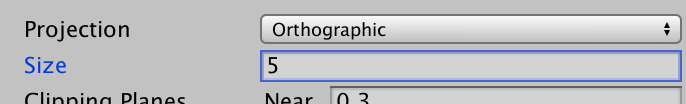
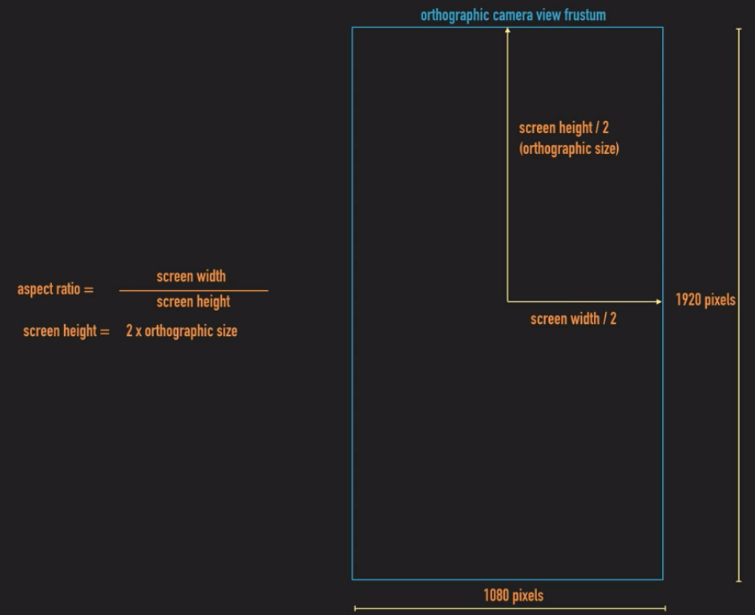
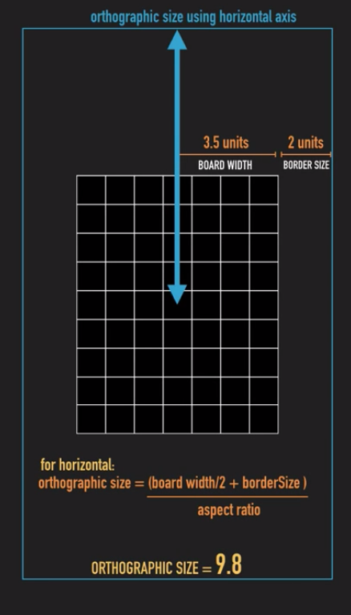

# Game unit and pixel per unit

## 요약
- Unity는 object의 크기를 pixel로 나타내지 않음
- 2D game 개발 시, 2D assets의 크기를 결정하는데 헷갈릴 수 있음 (How big do they need to be?)
- Game unit은 게임 화면을 구성하는 단위 unit (게임 화면의 grid의 한 칸)
- 2D game은 game unit이 몇 pixel로 구성되는지 정의 필요
	* ex) Tilemap의 타일을 game unit 하나와 동일하게 정의 (pixel per unit을 타일 크기와 같게)
	* 1 tile = 1 unit (It might be nice to keep a scale of 1 tile = 1 unit)
	* 맵을 구성하거나, 캐릭터의 이동 속도, 점프 높이, 사물의 크기 등을 직관적으로 설정 할 수 있음

## Pixels per unit
- 2D sprite asset을 import하면, Pixels per unit (PPU)라는 값을 설정 할 수 있음
- 1 unit을 구성할 pixel 개수를 의미
	* 300 x 100 2D sprite는 100 PPU로 설정되면, 3 x 1 unit이 기본 크기

## Orthographic camera size
- Camera의 projection 방식이 orthographic인 경우, camera view의 vertical size를 정하는 속성 값을 정의할 수 있음
	* Orthographic 방식은 perspective 없이, objects를 uniform하게 render (2D camera)

- Orthographic 카메라의 size도 unit 값을 따름
	* vertical axis를 기준으로 카메라가 얼마나 많은 unit을 framing할 것인지 결정 (when doubled)
	* Size 5인 경우, 수직으로 10 Unity unit이 보여짐
	* Horizontal axis는 vertical를 기준으로 결정됨 (user's screen의 aspect ratio)
	* Aspect ratio (16:9); 10 (vertical size) x 16 / 9 = 17.7 (horizontal size)

## 참고 페이지
- https://explodingrabbit.com/game-units-577/
- https://blogs.unity3d.com/kr/2018/11/19/choosing-the-resolution-of-your-2d-art-assets/
- https://devonce.tistory.com/20
- https://blogs.unity3d.com/kr/2019/08/02/2d-pixel-perfect-how-to-set-up-your-unity-project-for-retro-16-bit-games/
- http://egloos.zum.com/hanhoa/v/5863743
- https://kupaprogramming.tistory.com/41
- https://wonsorang.tistory.com/391