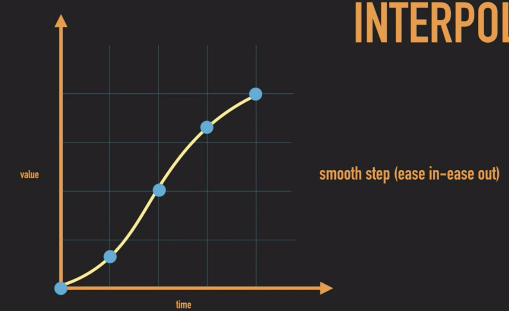

# Linear Interpolation

## 요약
- Interpolates between the two vectors a and b by the interpolant t
- This is most commonly used to find a point some fraction of the way along a line between two endpoints (e.g. to move an object gradually between those points).

- 두 벡터 사이를 선형으로 보간(interpolation)
	* 보통 어떤 오브젝트를 gradually 이동시킬 때 사용
	* t 값은 두 벡터를 잇는 직선을 만드는 점을 보간하는 비율을 의미
	* t의 범위는 (0,1]
	* 두 벡터 사이의 시간에 따른 위치를 반환 (t가 0.5면 두 벡터 중간 위치 반환; t가 1일 때 목적지 벡터 값 반환)
	* 시작 벡터 a에서 도착 벡터 b까지 선형 이동하는데, 어떤 시간 함수를 만족해서 선을 이동할 것인지 결정


<!-- <imge src="image/lerp_diagram.png" width="500"> -->

## 보간 함수
- t에 대한 함수로 시간에 따라 두 벡터간의 직선을 보간하는 비율을 조정할 수 있음
- 게임은 프레임 단위로 시간이 흐르기 때문에, 프레임 단위로 보간하기 위해 'DeltaTime' 사용
- 0에서 1까지의 비율을 보간하는 함수를 이용하여, 오브젝터의 선형 이동 움직임을 조정
- 게임에서 사용하는 대표적인 선형 보간 함수로 'SmoothStep'가 있다.
	* a family of sigmoid-like interpolation and clamping functions

```cs
	elapsedTime += Time.deltaTime;

	// calculate the Lerp value
	float t = Mathf.Clamp(elapsedTime / timeToMove, 0f, 1f);

	switch (interploation)
	{
	    case InterpType.Linear:
	        break;
	    case InterpType.EaseOut:
	        t = Mathf.Sin(t * Mathf.PI * 0.5f);
	        break;
	    case InterpType.EaseIn:
	        t = 1 - Mathf.Cos(t * Mathf.PI * 0.5f);
	        break;
	    case InterpType.SmoothStep:
	        t = t * t * (3 - 2 * t);
	        break;
	    case InterpType.SmootherStep:
	        t = t * t * t * (t * (t * 6 - 15) + 10);
	        break;
	}

	transform.position = Vector3.Lerp(startPosition, destination, t);
```

Linear            |  Ease-In
:-------------------------:|:-------------------------:
 |  

<!--  -->

Ease-Out            |  SmoothStep
:-------------------------:|:-------------------------:
 | 

## 참고 페이지
- https://docs.unity3d.com/kr/530/ScriptReference/Vector3.Lerp.html
- http://developug.blogspot.com/2014/09/unity-vector-lerp.html
- https://iygames.tistory.com/6
- https://m.blog.naver.com/pxkey/221326341246
- https://en.wikipedia.org/wiki/Linear_interpolation
- https://en.wikipedia.org/wiki/Smoothstep