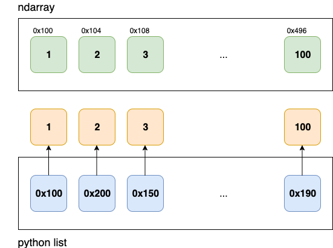

## numpy 모듈과 ndarray 이해하기

### numpy의 장점
- 성능: Python의 list보다 빠름 (ndarray 사용)
- 메모리 사이즈: Python의 list보다 적은 메모리 사용
- bulit-in 함수: 선형대수, 통계관련 여러 함수 내장

### ndarray
- numpy에서 다차원 리스트를 표현할 때 사용하는 데이터 타입
	- c언어로 내부 구현
	- 물리적인 메모리에 묶여서 할당됨
	- 연속된 메모리 vectorization 사용
	* python list는 연속되지 않은 메모리
	* numpy array는 fixed-type array로, contagious block 데이터에 대한 single pointer
	* python list는 dynamic type에 대한 Python object를 가리키는 포인터 블록들에 대한 포인터
- 참고자료: https://jakevdp.github.io/PythonDataScienceHandbook/02.01-understanding-data-types.html

