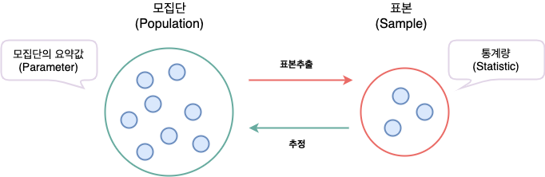

# 통계학 개념, 자료의 종류, 자료의 요약

## 통계학이란?
- 모집단(Population): 연구의 대상이 되는 모든 개체의 집합
	* 일반적으로 시간적, 공간적 제약으로 인해 모집단 전체에 대한 분석은 불가능
	* 모든 개체들을 관측하는 것은 현실적으로 어려움
- 표본(Sample): 모집단에서 나온 관측값들
	* 표본으로부터 모집단의 특성을 추정 및 추론

- 모수(Parameter): 수치로 표현되는 모집단의 특성
- 통계량(Statistic): 모수를 추정하기 위해 표본의 관측값들에서 결정된 값

## 자료의 종류
- 수치형(양적자료; Quantitive)
	* 연속형 (예: 몸무게, 키)
	* 이산형 (예: 전화 통화 수)

- 범주형(질적자료; Qualitive)
	* 순위형 (예: 학점)
	* 명목형 (예: 성별)

반응변수/설명변수|범주형            |  연속형
:-:|:-------------------------:|:-------------------------:
범주형(이분형)|범주형 자료분석 (카이스퀘어 검정) | 로지스틱 회귀분석
연속형|분산 분석 | 회귀 분석

## 자료의 요약(기술통계)
- 관측 집단의 형태, 위치, 분포, 관계를 파악하기 위함
- 범주형 자료
	* 도수 분포표 (Frequency distribution table)
	* 막대 / 원형 그래프
- 연속형 자료
	* Box plot
	* 히스토그램(Histogram)