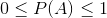
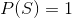
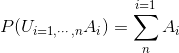
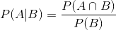
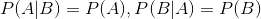

# 확률의 기초

## 확률실험 (Random experiment)
- 아래와 같은 속성을 가진 관찰(observation)이나 인위적인(artifical) 실험
	* 실험의 결과는 미리 알 수 없음
	* 실험에서 발생하는 모든 결과는 사전에 알고 있음
	* 이론적으로는 실험 반복 가능

- 주요 개념
	* **표본공간(Sample space)**: 모든 결과들의 집합
	* **근원사건(Sample outcome)**: 표본 공간의 원소
	* **사건(Event)**: 표본 공간의 부분집합. 근원사건의 집합
		* **배반 사건(Mutually exclusive events)**: 교집합이 공집합인 사건

## 확률(Probability)
- 어떠한 사건이 일어날 가능성의 정도
- 확률의 공리
	* 
	* 
	* 어떤 사건들이 서로 배반 사건일 때, 이 사건들의 합사건의 확률은 각각의 사건의 확률의 합과 같음
		* 

## 조건부 확률
- 사건 B에 대한 정보가 주어졌을 때, 사건 A의 교정된 확률 (전체 공간이 B에 한정됨)
- B가 주어졌을 때, 사건 A의 조건부확률
	* 

## 독립
- 사건 A와 B가 서로에게 아무런 영향을 미치지 않는 경우
- 
	* 

## 참고 자료
- [Book] 프로그래머를 위한 확률과 통계 (히라오카 카즈유키, 호리 겐)