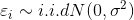
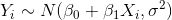
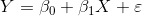

# 회귀분석이란

## 회귀분석
- 입력 변수 X의 정보로 출력 변수인 Y를 예측하는 방법
- 가장 대표적인 방법으로 단순 선형 회귀 분석이 있음
- 대부분의 분류모델(SVM, Decision Tree)로도 회귀가 가능

## 단순 선형 회귀분석 (Simple Linear Regression analysis)
- Assumption
	* 독립 변수 X와 종속 변수 Y가 선형 관계
	* 잔차(residual; epsilon)가 정규 분포를 따름 
		* i.i.d (independent identically distributed): 각각의 random variable이 독립 + 동일한 확률분포를 가짐(주사위)
		* 잔차는 표본 집단의 회귀식에서 예측값과 실제값의 차이를 의미(오차는 모집단의 경우)
		* 
	* 종속 변수 Y가 정규 분포를 따름
		* 
- 입력 변수가 하나인 모델
- 
- 베타1은 기울기(slope), 베타0은 절편(intercept)로 통칭하여 회귀계수(coefficients)
- 데이터를 가장 잘 설명(잔차가 최소화되는)하기 위하여, 회귀계수를 데이터로부터 추정(estimation)