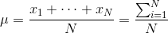
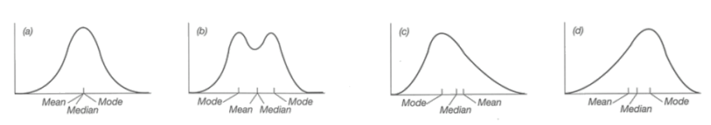
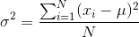
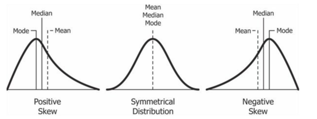
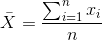
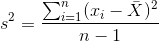

# 기술통계량, 추정량

## 자료의 요약 - 수치
- 모집단 개체의 수: N
- 중심 경향값 (대표값; Representative value)
- 평행이동

	* **평균 (Mean)**:  
	* **중앙값 (Median)**: 크기순으로 정렬시켰을 때, 중앙에 위치한 값
	* **최빈값 (Mode)**: 가장 자주 나오는 값

- 좌우대칭, 하나의 봉우리: Mean, Median, Mode 일치 (a)
- 좌우대칭, 두 개의 봉우리: Mean과 Median 일치, Mode는 값에 따라 봉우리 (b)
- Skewed 형태의 경우, outlier 값에 영향을 많이 받는 Mean이 꼬리 쪽에 더 가깝고, Mean 보다 안쪽에 Median

- 산포도 (퍼진 정도; Dispersion)

	* **분산 (Variance)**
		* i번째 관측값이 mean으로부터 얼마나 떨어져 있는지에 대한 정보
		* mean을 기준으로 방향 상관없이 거리정도만 파악하기 위해 제곱 
		* 
	* **사분위수 범위 (Inter quartile range)**
		* 전체 관측값을 크기순으로 정렬
		* 중앙에 위치한 50%의 관측치가 가지는 범위
	* **정규분포 (Normal distribution)**
		* 위치는 Mean, 모양은 Variance

- 왜도 (Skewness)
	* 분포의 비대칭 정도
	* Left-skewed는 Negative skewed (The left tail is longer)
	* The mass of the distribution is concentrated on the right of the curve
	* https://en.wikipedia.org/wiki/Skewness
	

- 첨도 (Kurtosis)
	* 분포의 꼬리 부분의 비중에 대한 측도
	* 정규분포를 기준으로 더 높으면 양수, 낮으면 음수 

## 추정량

- 추정량(Estimator): 모수(Parameter)를 추정하기 위한 통계량(Statistic)
- 추정량의 종류
	* **표본평균 (Sample Mean)**: 
	* **표본분산 (Sample Variance)**: 
