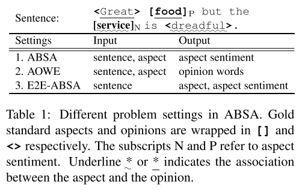
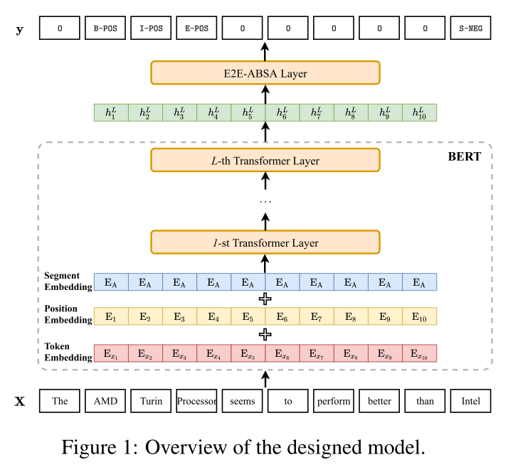

# Exploiting BERT for End-to-End Aspect-based Sentiment Analysis
## Abstract
E2E-ABSA task에서 BERT와 같은 pretrained language 모델의 contextualized embeddings의 power를 분석한다. 실험에서는 단순히 linear classification layer를 이용한 BERT-based 구조만으로도 기존 SOTA 모델보다 좋은 성능을 보였다. 기존 연구에서 고려되지 않았던, hold-out development dataset을 활용한 model selection으로 비교 연구를 진행하였다.

## Introduction
### Problem settings
ABSA task와 연관된 research problems를 아래 Table 1과 같이 요약할 수 있다.

1. **ABSA** - 주어진 aspect에 대한 문장의 polarity를 예측 (classification problem)
2. **AOWE** - 주어진 aspect에 대한 aspect-specific opinion words를 추출 (sequence tagging problem)
3. **E2E-ABSA** - aspect term/categories와 이에 해당하는 aspect sentiments를 동시에 판별

<!--  -->

### Previous approaches
기존의 많은 neural models는 task-agnostic pre-trained word embedding layer와 task-specific neural architecture가 별개로 제안 되었다. Accuracy나 F1 score로 평가하던 모델의 성능 개선은 bottleneck에 봉착하였다.

* Task-agnostic embedding layer(linear layer initialized with Word2Vec, GloVe)는 단어의 문맥과 무관한 context-independent word-level features만 제공
* 이와 같은 features는 문장 내에서 복잡한 의미적 의존성을 capture하기에 충분하지 않음
* 존재하는 데이터셋은 복잡한 task-specific 구조를 학습할 만큼 충분하지 않음

따라서, 이런 한계를 극복하기 위해 deep LSTM 또는 Transformer와 같은 모델로 대규모 데이터셋을 학습하여 context-aware word embedding을 도입하기 시작하였다. Labeld data로 가벼운 task-specific network를 fine-tuning하는 것이 성능을 향상 시킬 수 있었다. ABSA task에서 deep contextualized word embedding layer와 downstream neural 모델을 결합하려는 시도가 시작되었다.

본 연구에서는 새로운 task-specific 구조를 개발하는 것이 아니라, E2E-ABSA를 위한 다양한 layer를 BERT의 contextualized embedding과 결합하여 각각의 potential을 알아보고자 하였다.   

## Model
E2E-ABSA task는 sequence labeling 문제로 formulate 할 수 있다. 전체 아키텍처 모습은 아래 Figure 1과 같다.

주어진 input token sequence로 BERT Embedding layer로 contextualized representations을 계산하여, task-sepcific layer로 feed하여서 tag sequence를 예측한다.

<!--  -->

주어진 입력 token sequence:

*L* transformer layers를 가진 BERT component로 대응하는 contextualized representations 계산:

